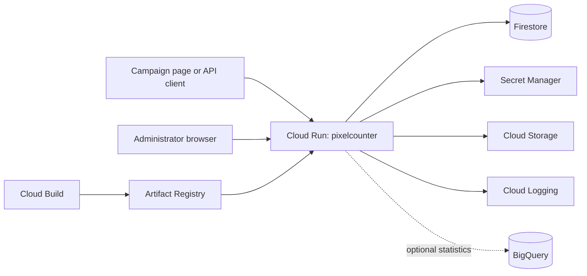

# Pixel Counter Engineering Handover

**Application:** Greenpeace Pixel Counter / Counter App  
**Production URL:** <https://counter.greenpeace.org>  
**Repository:** <https://github.com/greenpeace/gpi-techlab-pixelcounter>  
**Current repository version:** `v1.8.0`  
**Primary region:** `europe-north1`  
**Last reviewed:** 2026-10-05

This document is the starting point for the engineer taking ownership of the
application. The README contains detailed feature documentation and API examples;
this guide concentrates on ownership, operation, deployment, troubleshooting,
and the places where mistakes have the greatest impact.

## 1. Complete these ownership details before handover

| Item | New owner / location |
|---|---|
| Primary engineer | TODO |
| Backup engineer | TODO |
| Product owner | TODO |
| Security contact | TODO |
| GCP project administrators | TODO |
| GitHub repository administrators | TODO |
| Cloud Build trigger administrators | TODO |
| DNS owner for `counter.greenpeace.org` | TODO |
| Incident communication channel | TODO |
| Monitoring dashboard and alert links | TODO |
| Operational documentation Google Doc | TODO |

The incoming engineer should verify access to GCP, GitHub, Cloud Build, Cloud
Run, Firestore, Secret Manager, Artifact Registry, Cloud Logging, the production
domain, and the application administrator interface before the current owner
leaves.

## 2. What the application does

The application is a Flask service used to create and manage campaign counters.
Public or authorized requests increment a counter after request validation and,
when supplied, an email hash prevents duplicate counting. It also provides:

- Counter administration and usage history.
- API key creation and validation.
- Allowed-origin and blocked-path controls.
- User, role, page-permission, and NRO administration.
- Google, Okta, and ODC login flows, plus optional two-factor authentication.
- QR-code generation backed by Cloud Storage.
- URL shortening, with optional BigQuery statistics.
- An embedded Google Doc for user-facing documentation.

The main public counting routes are `/count`, `/count_pixel`, and `/counter`.
The remote counter-creation route is `/api/createcounter` and requires an API
key in the `X-API-Key` header.

## 3. Architecture



The service runs from `app.py` through Gunicorn with two workers and a 30-second
timeout. The Docker image uses Python 3.12. Cloud Run passes `PORT`, normally
8080. The service is public at the infrastructure level; application code
enforces authentication and authorization on protected routes.

### Important source locations

| Location | Responsibility |
|---|---|
| `app.py` | Flask initialization, blueprints, CSRF exemptions, security headers, error handlers |
| `modules/pixelcounter/` | Counter CRUD, public count endpoints, duplicate protection, history |
| `modules/auth/` | Login providers, JWT sessions, authorization helpers, rate limiting |
| `modules/users/` | User, role, 2FA, permissions, login and secret administration |
| `modules/apikey/` | API key lifecycle |
| `modules/nro/` | NRO administration |
| `modules/qrcode/` | QR-code generation and Cloud Storage |
| `modules/urlshortner/` | Short URLs and optional BigQuery tracking |
| `system/firstoredb.py` | Firestore client and production/test collection selection |
| `system/getsecret.py` | Secret lookup and local fallback |
| `templates/`, `static/` | Shared UI templates and browser assets |
| `tests/` | Pytest regression tests |
| `cloudbuild-*.yaml` | Current test and production image deployment paths |
| `terraform/` | Older/infrastructure provisioning definitions; review before applying |

## 4. Environments and deployment

| Environment | Trigger | Cloud Build file | Cloud Run service | Database mode |
|---|---|---|---|---|
| Test | Push to `main` | `cloudbuild-test.yaml` | `pixelcounter-test` | `IS_PRODUCTION_DB=false` |
| Production | Semantic version tag such as `v1.9.0` | `cloudbuild-prod.yaml` | `pixelcounter` | `IS_PRODUCTION_DB=true` |

Both pipelines build and push images to Artifact Registry in `europe-north1`.
Production should have build approval enabled. Production uses the tag as
`APP_VERSION`; local and test deployments read `VERSION`.

### Normal release procedure

1. Create a branch and make the change.
2. Run the relevant tests, then the complete suite with `pytest -q`.
3. Merge to `main` and let the test trigger deploy `pixelcounter-test`.
4. Exercise affected routes in test and inspect Cloud Logging.
5. Update `VERSION` and release notes as appropriate.
6. Create an annotated semantic version tag from the verified `main` commit.
7. Push the tag and approve the production Cloud Build.
8. Verify the Cloud Run revision, displayed application version, main workflows,
   and error logs.

Example commands, with the intended version substituted:

```bash
git checkout main
git pull
pytest -q
git tag -a v1.9.0 -m "Release v1.9.0"
git push origin v1.9.0
```

### Rollback

Use Cloud Run revision traffic management to send 100% of production traffic
to the last known-good revision. Confirm that the older revision uses compatible
Firestore data and required secrets. After service recovery, revert or fix the
code on `main`; do not leave the release history diverged from the running
revision.

### Infrastructure caution

The Terraform definitions include image building and fixed image tags, while the
Cloud Build files describe the current tag-based deployment flow. The production
Terraform local currently references `v0.34`, which is older than the application
version. Review the plan carefully before applying Terraform and reconcile it
with the Cloud Build-managed Cloud Run configuration.

## 5. Configuration and secrets

`GCP_PROJECT` selects the GCP project. If absent, the code currently falls back
to `make-smthng-website`. Set it explicitly in Cloud Run to prevent an accidental
connection to the wrong project.

`IS_PRODUCTION_DB` is the critical data isolation switch:

- `true` selects production Firestore collections.
- Any other value selects collections whose names end in `-test`.

`IS_PRODUCTION` enables secure cookies, proxy handling, HSTS, and production
runtime behavior. The test Cloud Run service deliberately uses
`IS_PRODUCTION=true` with `IS_PRODUCTION_DB=false`.

Secrets are loaded in this order:

1. An environment variable named `PIXELCOUNTER_SECRET_<NORMALIZED_NAME>`.
2. An individual Google Secret Manager secret.
3. The `sct_config_app` JSON secret.
4. Local `config/config.json`.

Relevant secret/configuration names found in the application include:

- `app_secret_key`
- `client_secret_key`
- `client_secret_file`
- `restrciteddomain` (the spelling is part of the interface)
- `okta_client_id`, `okta_client_secret`, `okta_issuer`
- `odc_client_id`, `odc_client_secret`, `odc_issuer`
- `service-account-key`
- `qrcode-bucket_name`
- `urlshortner_stats_dataset_id`, `urlshortner_stats_table_id`
- `tracking_stats_dataset_id`, `tracking_stats_table_id`
- `openai_api_key` for the module-management functionality

Never put real values in this document. `config/config.json` is ignored by Git
and is only a local fallback. During handover, rotate any credential previously
shared outside its approved secret store and verify that the Cloud Run runtime
service account has only the permissions it needs.

## 6. Firestore data

Production collection names are listed below. Test normally uses the same name
with `-test` appended.

| Collection | Purpose |
|---|---|
| `counters` | Counter definitions, totals, and optional hourly history |
| `amialhash` | Duplicate protection using counter and email hash |
| `allowedorigion` | Allowed request origins |
| `disallowedorigion` | Blocked request patterns |
| `users` | Users, roles, NRO, 2FA and assignments |
| `apikeys` | API keys and active state |
| `nro` | National and regional office records |
| `qrcode` | QR-code metadata |
| `moln-url` | Short URL records |
| `login_config` | Enabled login-provider configuration |
| `page_permissions` | Role/page access rules |
| `system_activity` | Administrative activity records |
| `api_rate_limits` | Per-client fixed-window rate-limit counters |
| `documentation` | Embedded Google Doc configuration |
| `blog` | Module/blog-related records |

Some historical collection names contain spelling errors. Treat these names as
public data interfaces and do not rename them without a migration and rollback
plan.

Enable a Firestore TTL policy on the `expires_at` field for both
`api_rate_limits` and `api_rate_limits-test`. Without TTL, expired rate-limit
documents continue to accumulate.

No documented automated backup and restore procedure was found in the repository.
Before ownership transfers, record the actual Firestore backup/export schedule,
retention, storage location, restore procedure, and the date of the most recent
successful restore test in the ownership table or linked operational document.

## 7. Local development

Prerequisites:

- Python 3.12 for parity with the container.
- Access to a non-production GCP project or Application Default Credentials.
- Local development secret values through environment overrides or an ignored
  `config/config.json` based on `config/config-example.json`.

Typical setup:

```bash
python3.12 -m venv .venv
source .venv/bin/activate
python -m pip install -r requirements.txt
export GCP_PROJECT='<test-project>'
export IS_PRODUCTION=false
export IS_PRODUCTION_DB=false
python app.py
```

The application is then available at <http://127.0.0.1:8080>. Never run local
development with `IS_PRODUCTION_DB=true`.

Run tests with:

```bash
pytest -q
```

Tests provide inert secret values through `tests/conftest.py`. Add focused tests
for transaction behavior, access rules, API-key validation, form responses, and
documentation configuration when those areas change.

## 8. Access control and security model

- Browser sessions use a signed internal JWT stored in the Flask session.
- The normal session lifetime is 30 minutes.
- Login supports Google, Okta, and ODC, subject to stored provider settings.
- The restricted login domain is controlled by `restrciteddomain`.
- Administrative pages use roles and page-permission records.
- Counter visibility combines administrator access, ownership, global scope,
  matching NRO, and explicit user assignment.
- Machine clients send API keys through `X-API-Key`; query-string API keys are
  intentionally unsupported because URLs are logged widely.
- Public machine endpoints are exempted from browser CSRF checks. Protected form
  submissions retain CSRF protection.
- `ProxyFix` trusts one proxy hop in production. Reassess this if the load-balancer
  topology changes because client-IP handling affects security and rate limiting.

When transferring ownership, give the incoming engineer an individual account.
Do not share an existing administrator identity or API key.

## 9. Rate limiting and high traffic

The `rate_limit()` decorator uses a fixed time window. It identifies a client by
`X-API-Key`, then by `request.remote_addr`, and hashes the endpoint, identity, and
time bucket into a Firestore document ID. Each accepted request performs a
transactional read and write before the endpoint's own database work.

Defaults are five requests per 60 seconds. Public count endpoints override this
with 300 requests per 60 seconds.

Five thousand distinct client identities create activity across roughly 5,000
rate-limit documents. If a proxy causes them to share one detected IP, they
instead contend on one document and share one limit. At sustained high volume,
consider moving rate enforcement to Cloud Armor, an API gateway, or a dedicated
low-latency rate-limit store.

### Q: Is “The referenced transaction has expired” caused by a Firestore quota?

Not necessarily. It means Firestore rejected a transaction because its
transaction ID was no longer valid. Causes can include concurrent requests to
the same rate-limit record, a delay before commit, or a temporary network or
Firestore service delay. Direct quota failures usually report
`RESOURCE_EXHAUSTED`, HTTP 429, or “Quota exceeded.” A traffic burst can
contribute indirectly, especially when many requests share one API key or
detected IP, but the expired-transaction message alone does not prove that a
quota was exceeded.

The rate limiter retries that exact expired-transaction failure once using a new
transaction. Repeated failures should be investigated in Cloud Logging rather
than hidden.

## 10. Operational checks

### After every production deployment

- Confirm the newest Cloud Run revision is serving 100% of traffic.
- Confirm the displayed version matches the release tag.
- Load the landing page and perform one authorized login.
- Exercise a test counter through the supported count method.
- Confirm duplicate email-hash handling does not increment twice.
- Verify one administrator list page and the embedded documentation page.
- Inspect Cloud Logging for new 4xx/5xx spikes, startup failures, and Firestore
  exceptions.

### Routine maintenance

- Review Cloud Run error rate, latency, instance count, and request volume.
- Review Firestore usage, hot documents, indexes, storage growth, and TTL status.
- Check Secret Manager secret age and rotation requirements.
- Check dependency and container vulnerability reports.
- Confirm test and production builds still run from the documented triggers.
- Test a rollback and a data restore on a planned schedule.
- Remove or deactivate unused API keys and administrator accounts.
- Check that OAuth redirect URIs still match test and production domains.

## 11. Troubleshooting runbooks

### Application returns 500 on startup

1. Open the failing Cloud Run revision logs.
2. Look for missing Secret Manager access, invalid JSON in OAuth/service-account
   secrets, missing GCP APIs, or Firebase initialization failures.
3. Confirm `GCP_PROJECT`, `IS_PRODUCTION`, and `IS_PRODUCTION_DB` on the revision.
4. Confirm the runtime service account can read required secrets and Firestore.
5. Route traffic back to the previous revision if service is unavailable.

### `jinja2.exceptions.TemplateNotFound`

The route points to a template file that is absent from its blueprint template
directory. If the page is obsolete, remove the route so Flask returns the normal
404 page. If the page is required, restore the template and add a route test.
Do not suppress `TemplateNotFound` globally.

### Firestore transaction expired

1. Check request volume and whether many requests share an API key or source IP.
2. Check Cloud Run latency and Firestore service health around the event.
3. Search for repeated expired-transaction warnings after the built-in retry.
4. Check for hot documents and Firestore quota errors separately.
5. If sustained load is the cause, move rate limiting upstream or redesign the
   key distribution; repeatedly increasing retries can amplify load.

### Users cannot log in

1. Determine which provider was used: Google, Okta, or ODC.
2. Confirm the provider is enabled in the application login configuration.
3. Verify client ID, secret, issuer, and redirect URI.
4. Check the restricted domain and the user's email domain.
5. Inspect Cloud Run logs without logging tokens or secret values.
6. Confirm session cookie settings and proxy headers on the production domain.

### Test data appears in production or settings disappear

Check `GCP_PROJECT` and `IS_PRODUCTION_DB` on the serving revision first. The
documentation setting, for example, is `documentation/main` in production and
`documentation-test/main` in test. Cloud Build uses `--update-env-vars` so it
preserves unspecified service configuration; using `--set-env-vars` manually can
erase variables omitted from the command.

### Counter is not incrementing

Check, in order:

1. API-key validation when a key is required.
2. Counter ID presence and exact counter record.
3. Allowed origin, path, and IP rules.
4. Duplicate `counter + email_hash` handling.
5. Rate-limit responses.
6. The Firestore counter transaction and its logs.

## 12. Known risks and follow-up work

- The repository does not document the real monitoring, alerting, backup, restore,
  or incident ownership locations. Complete Section 1 before handover.
- Firestore is also used for request rate limiting, adding a read, write, and
  commit to every limited request.
- Correct client IP detection depends on the proxy topology and one trusted proxy
  hop.
- `GCP_PROJECT` has a hard-coded fallback; production should always set it.
- Several data collection and configuration names contain historical spelling
  errors and require migration planning before correction.
- Terraform and Cloud Build describe overlapping deployment mechanisms and fixed
  Terraform image tags are stale. Establish one authoritative infrastructure and
  deployment path.
- BigQuery tracking code can include request metadata. Confirm its current use,
  retention, access controls, and privacy basis with the relevant owner.
- Confirm whether module-management functionality and its `openai_api_key` are
  still required; remove unused code and credentials through a planned change.
- Establish and test recovery objectives for Firestore and Cloud Storage.

## 13. First week checklist for the incoming engineer

- [ ] Obtain individual access to every system listed in Section 1.
- [ ] Pair with the outgoing owner for a test and production deployment.
- [ ] Trace one count request from HTTP entry through Firestore commit.
- [ ] Review production environment variables without copying secret values.
- [ ] Review service-account IAM roles and Secret Manager permissions.
- [ ] Confirm Firestore TTL configuration for both rate-limit collections.
- [ ] Locate dashboards, alerts, backups, restore instructions, and incident history.
- [ ] Run the test suite and deploy a harmless change to the test service.
- [ ] Practice Cloud Run rollback.
- [ ] Review open issues, current roadmap, and outstanding security work.
- [ ] Remove the retiring engineer's access only after ownership and recovery
      access have been verified.

## 14. Handover sign-off

| Confirmation | Outgoing owner | Incoming owner | Date |
|---|---|---|---|
| Repository and branching explained |  |  |  |
| Test deployment completed |  |  |  |
| Production release observed |  |  |  |
| Rollback practiced |  |  |  |
| GCP and application admin access verified |  |  |  |
| Secrets and credential ownership transferred |  |  |  |
| Monitoring and incidents reviewed |  |  |  |
| Backup and restore procedure verified |  |  |  |
| Open risks and roadmap reviewed |  |  |  |

